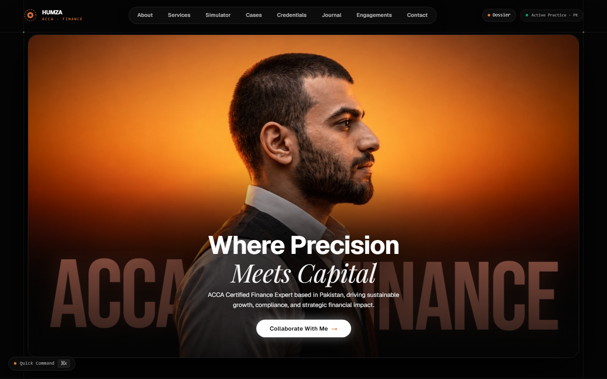

# HUMZA — ACCA Qualified Corporate Financial Advisory Platform

<p align="center">
  
</p>

<p align="center">
  <strong>Where Precision Meets Capital.</strong><br>
  Official digital advisory portfolio and interactive financial engineering platform for <strong>Humza</strong>, an ACCA-qualified corporate financial strategist and advisor based in Lahore, Pakistan.
</p>

<p align="center">
  <a href="#key-features">Key Features</a> •
  <a href="#interactive-financial-tools">Financial Tools</a> •
  <a href="#tech-stack">Tech Stack</a> •
  <a href="#getting-started">Getting Started</a> •
  <a href="#architecture">Architecture</a>
</p>

---

## 🌟 Overview

Designed with an ultra-premium executive aesthetic (Deep Obsidian `#050505`, Accent Amber `#E07A38`, and Editorial Serif typography), this platform is engineered for corporate boards, CFOs, audit committees, and institutional investors across **Pakistan** and the **GCC**.

Beyond a standard portfolio, it delivers functional financial tools, live statutory telemetry, and interactive case examinations.

---

## ✨ Key Features

### 1. 4K Cinematic Master Hero Stage
- Multi-plane 3D parallax depth with a pixel-matched 4K cutout silhouette.
- Animated 3D typography (**"ACCA"** & **"FINANCE"**) passing behind the subject.
- Subtle gyroscopic mouse illumination and warm golden ambient backlight.

### 2. Working Capital Liberation & Impact Simulator
- Dual-currency financial engine supporting both **PKR (₨ Billions)** and **USD ($ Millions)**.
- Real-time DSO (Days Sales Outstanding) slider calculating non-dilutive operating cash unlocked.
- Calibrated corporate industry presets:
  - *Textile Exporter (₨4.5B Turnover · 24 Days DSO)*
  - *Tech Scale-up ($8M Turnover · 18 Days DSO)*
  - *FMCG Distributor (₨10B Turnover · 15 Days DSO)*
- Direct **"Discuss Working Capital Strategy"** bridge to the contact brief.

### 3. Executive Curriculum Vitae & Dossier Modal
- Institutional, printable dossier replacing dead external links with on-demand access.
- Complete breakdown of **ACCA UK** syllabus competencies and **CFA Candidate** standing.
- Summary of verified track record (₨2.4B+ audit scope, Big-4 sign-offs, Series A VC decks).
- Formatted with dedicated CSS print rules for crisp A4/Letter PDF generation.

### 4. Interactive Advisory Scope Pipeline
- Market switcher between **Pakistan (PK)** and **Gulf & GCC (AE)** regulatory frameworks.
- Deep-dive cards spanning **IFRS 9/15/16**, **FBR Corporate Tax**, **SECP Governance**, and **DCF Valuation**.
- Interactive **"Inquire for this Scope"** trigger that auto-selects the discipline in the contact form with feedback toasts.

### 5. Ministerial Session & Delegation Archive
- Verified photographic archive of high-level policy consultations alongside **Federal Minister for Finance & Revenue H.E. Muhammad Aurangzeb**.
- High-resolution modal with detailed policy deliberation pillars:
  - Macro-Fiscal Stabilization & Tax Net Expansion
  - IFRS 9, 15 & 16 Corporate Adoption
  - Capital Formation & Governance Architecture

### 6. Strategic Financial Journal
- In-depth executive briefs analyzing:
  - *Navigating IFRS 16 Balance Sheet Transition for Multi-Plant Groups*
  - *Redesigning Internal Controls for High-Growth Enterprises (COSO 2013)*
  - *Pakistan Corporate Tax Reform: Super Tax 4C & FBR Strategy*
  - *From Retrospective Bookkeeping to Strategic Capital Velocity*
- Full reader modal with statutory references and executive takeaways.

### 7. Global Command Palette (`Ctrl+K` / `⌘K`)
- Rapid keyboard-driven search and navigation across all 8 platform sections.
- Quick actions: view dossier, copy direct advisory email, jump to liquidity simulator.

---

## 🛠️ Tech Stack

- **Framework**: [Next.js](https://nextjs.org/) (App Router, Turbopack & Webpack support)
- **Language**: [TypeScript](https://www.typescriptlang.org/)
- **Styling**: [Tailwind CSS](https://tailwindcss.com/) with tailored executive color tokens
- **Smooth Scrolling**: [Lenis](https://github.com/darkroomengineering/lenis)
- **Animations**: [Motion](https://motion.dev/) & Vanilla CSS GPU keyframes
- **Icons**: [Lucide React](https://lucide.dev/)
- **Typography**: Playfair Display (Serif), Geist (Sans), Bebas Neue (Display)

---

## 🚀 Getting Started

### Prerequisites
- [Node.js](https://nodejs.org/) v18+ (LTS recommended) or [Bun](https://bun.sh/)
- Git

### Installation

1. **Clone the repository:**
   ```bash
   git clone https://github.com/baigcoder/humza-portfolio.git
   cd humza-portfolio
   ```

2. **Install dependencies:**
   ```bash
   npm install
   # or
   bun install
   ```

3. **Start the local development server:**
   ```bash
   npm run dev
   ```
   Open [http://localhost:3000](http://localhost:3000) in your browser.

4. **Build for production:**
   ```bash
   npm run build
   npm run start
   ```

---

## 📁 Repository Structure

```
├── public/
│   ├── images/
│   │   ├── gallery/          # Ministerial consultation photos
│   │   ├── humza-hero...     # Master 4K portraits & silhouette cutouts
│   │   └── sun-emblem.svg    # Brand emblem
│   └── ...
├── src/
│   ├── app/
│   │   ├── globals.css       # Design tokens, custom sliders & print rules
│   │   ├── layout.tsx        # SEO metadata, OpenGraph, JSON-LD schema
│   │   ├── page.tsx          # Master page orchestration
│   │   ├── robots.ts         # Search engine directives
│   │   └── sitemap.ts        # Dynamic XML sitemap with all anchors
│   ├── components/
│   │   ├── effects/          # CommandPalette, DossierModal, SmoothScroll, TiltCard
│   │   ├── hero/             # 4K parallax stage, back-text, portrait layers
│   │   ├── layout/           # SiteHeader, SiteFooter, ArchitecturalFrame
│   │   └── sections/         # About, Services, Simulator, Work, Credentials, Journal, Gallery, Contact
│   └── content/              # Profile, expertise, projects, credentials data
└── scripts/                  # Automated Puppeteer verification & image processing
```

---

## 📄 License & Attribution

© 2026 HUMZA, ACCA. All Professional Rights Reserved.  
Upholding the international [ACCA Code of Ethics and Conduct](https://www.accaglobal.com).
